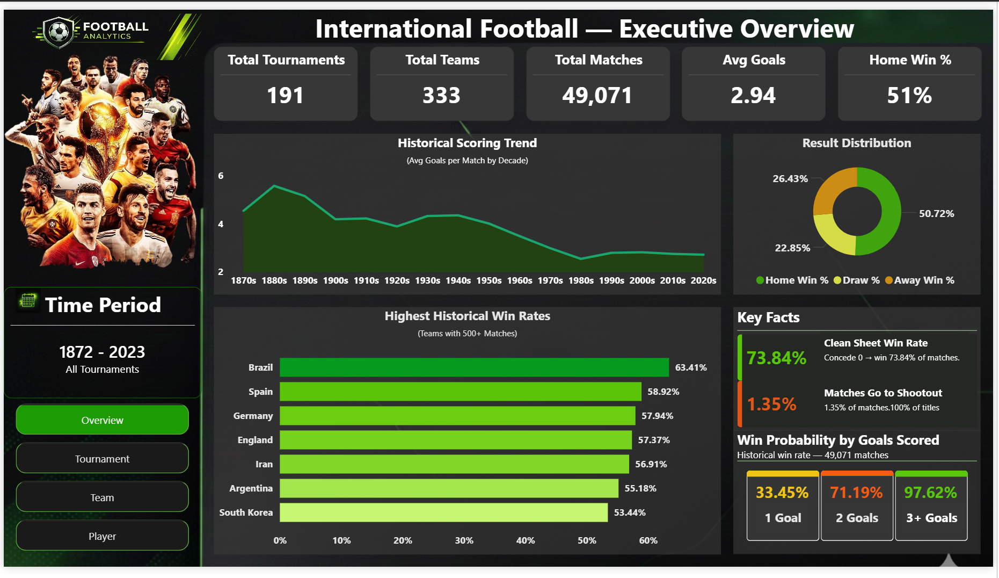
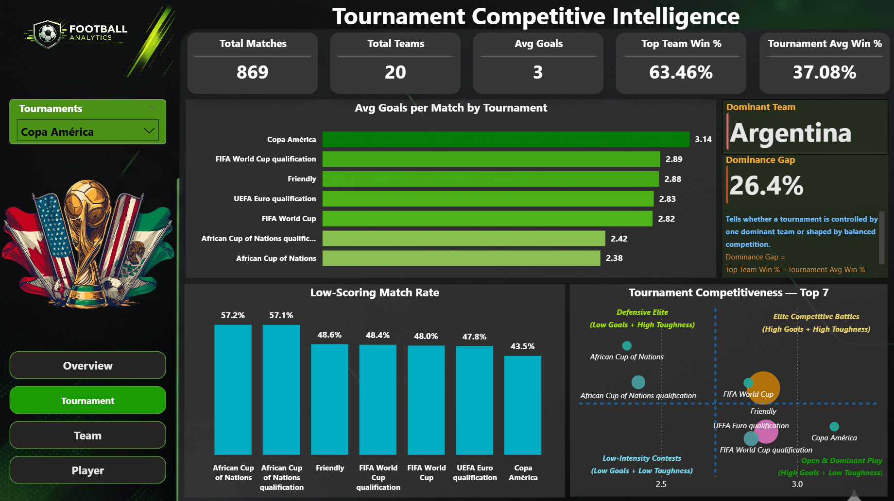
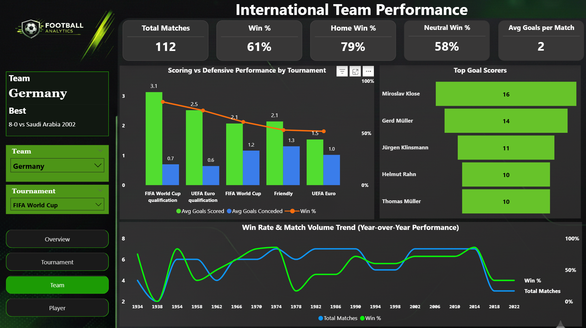
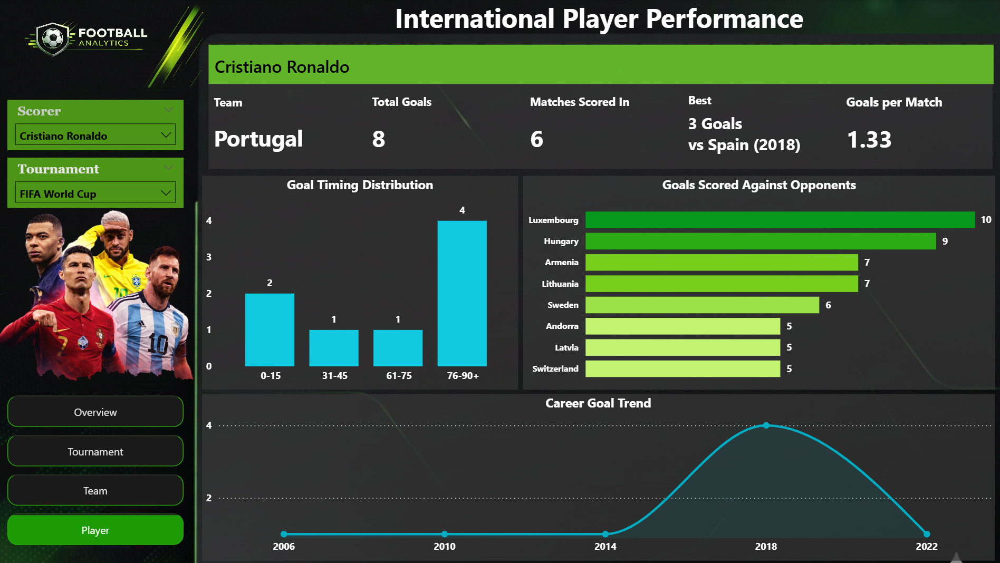

# ⚽ International Football Analytics – Performance & Insights

_End-to-end football analytics project analyzing 150+ years of international match data using MySQL and Power BI to uncover winning strategies for team management._

---

## 📌 Table of Contents
- <a href="#overview">Overview</a>
- <a href="#business-problem">Business Problem</a>
- <a href="#dataset">Dataset</a>
- <a href="#tools--technologies">Tools & Technologies</a>
- <a href="#project-structure">Project Structure</a>
- <a href="#data-cleaning--preparation">Data Cleaning & Preparation</a>
- <a href="#schema-design">Schema Design</a>
- <a href="#key-findings">Key Findings</a>
- <a href="#dashboard">Dashboard</a>
- <a href="#final-recommendations">Final Recommendations</a>
- <a href="#author--contact">Author & Contact</a>

---

<h2>Overview</h2>

This project analyzes 49,071 international football matches played between 1872 and 2023 across 191 tournaments and 333 teams. A complete data pipeline was built using MySQL for data ingestion, cleaning, and transformation into a star schema, and Power BI for interactive dashboard development. The goal was to extract actionable insights for a club board preparing for a competitive tournament season.

---

<h2>Business Problem</h2>

A football club board wants to improve team performance and boost fan engagement during the upcoming tournament season. The analytics team was assigned to answer:

- What key factors drive victory in international football?
- How does home vs. away venue affect match outcomes?
- Which teams and players are consistently top performers?
- How have goal-scoring patterns changed across decades?

---

<h2>Dataset</h2>

Three CSV files located in the `/Dataset` folder:

| File | Records | Description |
|------|---------|-------------|
| `results.csv` | 49,071 matches | Match date, teams, scores, tournament, city, country, neutral flag |
| `goalscorers.csv` | ~100,000+ events | Scorer name, minute, own goal & penalty flags |
| `shootouts.csv` | Subset of draws | Match reference, shootout winner, first shooter |

---

<h2>Tools & Technologies</h2>

- **MySQL** – Data ingestion, cleaning, transformation, star schema design
- **Power BI** – Interactive dashboard with 4 analytical pages
- **GitHub** – Version control and project showcase

---

<h2>Project Structure</h2>

<pre>
international-football-analytics-sql-powerbi/
│
├── 📁 Dashboard
│      └── Football_Dashboard.pbix
│
├── 📁 Dataset
│      ├── results.csv
│      ├── goalscorers.csv
│      ├── shootouts.csv
│      └── former_names.csv
│
├── 📁 Images
│      ├── overview.png
│      ├── tournament.png
│      ├── team.png
│      └── player.png
│
├── 📁 Report
│      └── Football_Analytics_Report.pdf
│
├── 📁 SQL
│      └── cleaned_data.sql
│
└── 📄 README.md
</pre>

---

<h2>Data Cleaning & Preparation</h2>

All cleaning was performed in MySQL before loading into Power BI:

- Validated row counts and date ranges (1872–2023)
- Checked for NULL values across all critical columns
- Detected and removed duplicate records on composite key `(match_date, home_team, away_team)`
- Converted TRUE/FALSE strings to binary 0/1 flags for neutral venue, own goals, and penalties
- Parsed added-time minute strings (e.g. `45+2`) into `minute_base` and `extra_minute` columns
- Engineered `minute_total`, `time_slot`, `match_result`, and `neutral_flag` derived columns

---

<h2>Schema Design</h2>

A star schema was designed to optimise Power BI query performance:

| Table | Type | Description |
|-------|------|-------------|
| `fact_matches` | Fact | One row per match with scores, result, and goal metrics |
| `dim_team` | Dimension | 333 unique international teams |
| `dim_tournament` | Dimension | 191 distinct competitions |
| `dim_date` | Dimension | Year, month, quarter hierarchy |
| `dim_goal_events` | Dimension | Individual goal records with timing and type |
| `fact_player_stats` | Aggregate Fact | Player-level scoring totals and patterns |
| `fact_penalty_analysis` | Aggregate Fact | Team-level penalty frequency metrics |

---

<h2>Key Findings</h2>

1. **Clean Sheet Win Rate: 73.84%** — Defensive solidity is the single strongest predictor of winning
2. **Home Win Rate: 51%** — Home teams win twice as often as away teams (26.43%)
3. **Scoring Threshold Impact** — Scoring 2+ goals → 71.19% win rate; 3+ goals → 97.62%
4. **Historical Goal Decline** — Average goals fell from ~5.5 (1880s) to ~2.8 (2020s)
5. **Brazil leads all-time** — 63.41% win rate among teams with 500+ matches
6. **Copa América** — Highest avg goals per match (3.14) across all major tournaments
7. **Argentina dominance gap** — 26.4% gap in Copa América signals one-sided competition
8. **Late goals matter** — 76–90+ minute band is the highest-volume scoring window for elite players

---

<h2>Dashboard</h2>

The Power BI dashboard has 4 interactive pages with cross-filtering slicers for Time Period, Tournament, Team, and Country.

**Page 1 – Executive Overview**

**Page 2 – Tournament Competitive Intelligence**

**Page 3 – International Team Performance**

**Page 4 – International Player Performance**

---

<h2>Final Recommendations</h2>

- **Prioritise defensive solidity** — 73.84% clean sheet win rate makes this the highest-ROI coaching investment
- **Maximise home advantage** — Treat every home fixture as a must-win opportunity
- **Invest in second-half fitness** — The 46–60 and 76–90+ windows are the highest-value scoring bands
- **Recruit for late-game impact** — Weight goals scored after the 76th minute in scouting models
- **Tailor preparation per tournament** — Copa América demands attacking play; African Cup demands defensive structure
- **Prepare for shootouts vs dominant opponents** — Dedicated penalty practice when facing teams with large dominance gaps

---

<h2>Author & Contact</h2>

**Adesh Bhosale**  
Data Analyst  
📧 Email: adeshbhosale30@gmail.com  
🔗 [LinkedIn](https://www.linkedin.com/in/adeshbhosale30/)